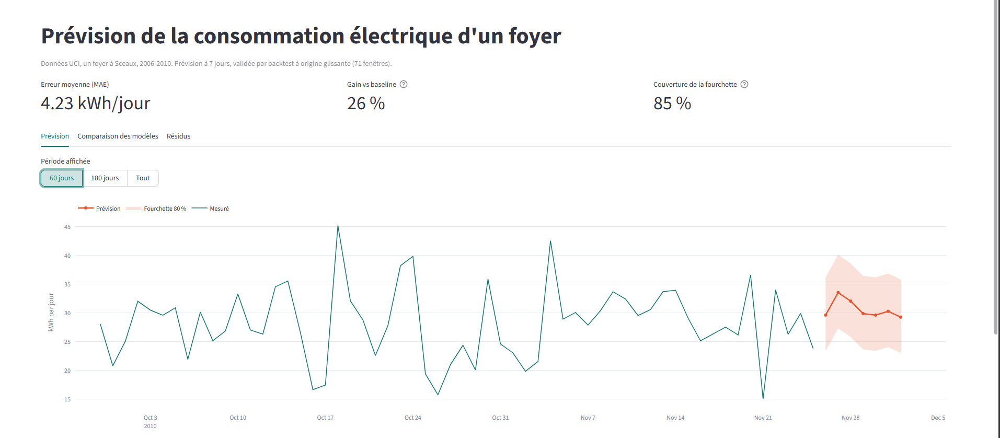
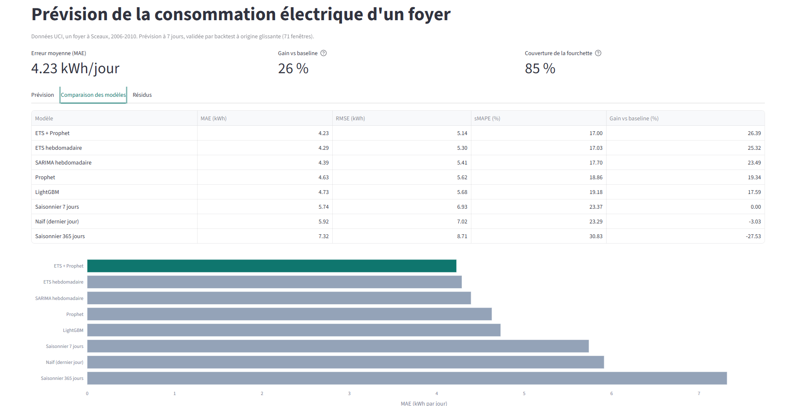

# Prévision de la consommation électrique d'un foyer

Prévision à 7 jours de la consommation journalière (kWh) d'un foyer, avec fourchette
d'incertitude, comparaison de 8 modèles et suivi des expériences (MLflow).

**Démo :** https://demand-forecast-cxcizfvxvwt4ydrvwhkswp.streamlit.app/




## Résultats

Backtest à origine glissante : 71 fenêtres de 7 jours, entraînement initial de 730 jours,
origines espacées de 10 jours (non multiple de 7, pour mélanger les jours de semaine).

| Modèle | MAE (kWh/jour) | Gain vs baseline |
|---|---|---|
| ETS + Prophet | 4,23 | -26 % |
| ETS hebdomadaire | 4,29 | -25 % |
| SARIMA hebdomadaire | 4,39 | -24 % |
| Prophet | 4,63 | -19 % |
| LightGBM | 4,73 | -18 % |
| Baseline : saisonnier 7 jours | 5,74 | 0 % |

Fourchette à 80 % : quantiles empiriques des résidus. Couverture mesurée hors
échantillon (quantiles calculés sur la 1re moitié des fenêtres, test sur la 2e) : **85 %**.

Intervalles de confiance (bootstrap sur les fenêtres, IC 95 %) : gain d'ETS + Prophet sur la baseline **26 %** (IC 95 % : 20 à 32). ETS + Prophet bat Prophet seul (-0,41 kWh, IC : -0,60 à -0,23) mais pas ETS (-0,06 kWh, IC : -0,28 à +0,14).

Test final tenu à l'écart : sélection sur les 48 premières fenêtres, test sur les 23 dernières (avril à novembre 2010). Le modèle choisi reste ETS + Prophet, gain 32 % (IC 95 % : 21 à 42).

## Limites assumées

- **Le gain solide est celui sur la baseline (environ 25 %).** L'écart entre ETS+Prophet et
  ETS seul (0,06 kWh) n'est pas démontré sur 71 fenêtres.
- **Un seul foyer, 4 ans** : peu de cycles annuels, la saisonnalité annuelle est mal
  estimée (Prophet ne bat pas ETS).
- **Le bruit domine** : absences et usages ponctuels sont imprévisibles sans variables
  explicatives (météo, présence).
- **Fenêtres chevauchantes** : les 71 fenêtres ne sont pas indépendantes.
- Le test final (23 dernières fenêtres) atténue le biais de sélection sans l'éliminer : les mêmes données ont servi à concevoir la liste de modèles, et le test ne couvre pas l'hiver.

## Pistes écartées

- **Température** (Open-Meteo, licence CC BY 4.0) : corrélation de -0,55 avec la consommation, mais elle vient de la saison (-0,87 sur la composante lente). Une fois la saison retirée, la corrélation des écarts est de -0,01 : la météo n'apporte rien de plus que la saisonnalité déjà modélisée. Non intégrée aux modèles.
- **Vacances scolaires** (zone C, dates des calendriers officiels de l'Éducation nationale saisies dans `src/calendar_fr.py`) : ajoutées comme variable explicative à Prophet, LightGBM et ETS + Prophet, sur les mêmes 71 fenêtres. Écart de MAE : -0,025 kWh/jour (Prophet), -0,12 (LightGBM), -0,02 (ETS + Prophet), tous avec un IC 95 % qui contient 0 (ETS + Prophet : -0,07 à +0,03). Les gains se concentrent sur les fenêtres qui touchent des vacances (-0,04 à -0,06 kWh), mais ne sont pas démontrés ; sur les 23 dernières fenêtres, LightGBM se dégrade (+0,25). Non retenues. Reproduire : `python -m src.run_vacances`.

## Méthode

- **Données :** UCI "Individual household electric power consumption", 1 mesure par minute,
  2006-2010. Agrégation en kWh/jour = puissance moyenne des minutes valides x 24 h.
  Jours avec moins de 80 % de minutes valides : exclus (21 jours sur 1 440).
- **Sans fuite de données :** pour chaque origine, le modèle ne reçoit que l'historique
  antérieur ; l'interpolation des trous est faite sur cet historique tronqué. Tests pytest
  sur ce point.
- **Modèles :** baselines (naïve, saisonnier 7 et 365 jours), ETS, SARIMA, Prophet,
  LightGBM (prévision récursive), moyenne ETS + Prophet.

## Lancer le projet

```
python -m venv .venv
.venv\Scripts\activate
pip install -r requirements-dev.txt
python -m src.run_all
python -m src.make_forecast
python -m streamlit run app.py
python -m pytest
```

Données brutes : archive UCI à placer dans `data/raw/`. L'app seule n'a besoin que de
`requirements.txt` (résultats pré-calculés).
